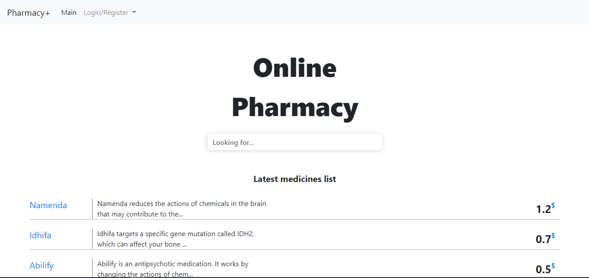
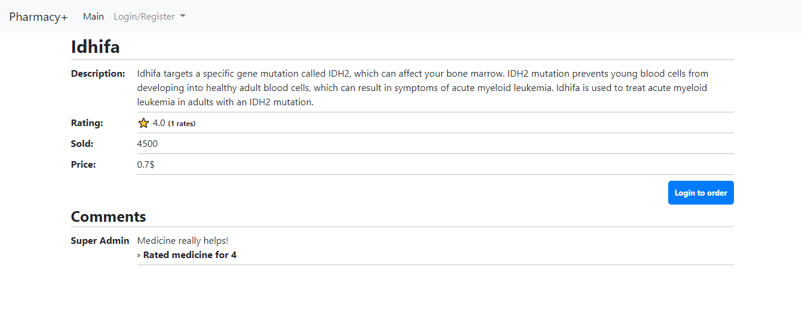
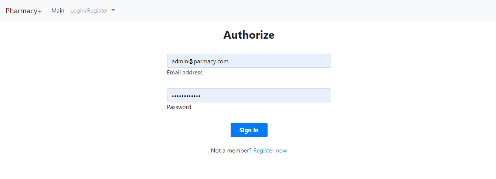
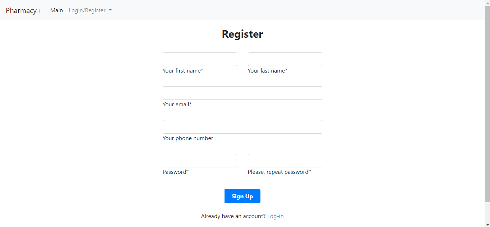

# Pharmacy+
## Online medicine order platform

Pharmacy. The client selects the necessary drug from the list of available ones.
Fills out the Order form, indicating the quantity and dosage. Client
pays for the order. The pharmacist manages the drug list. Part
drugs require an electronic prescription, which can be prescribed
Client only Doctor. The client can request the Doctor for an extension
prescription.


> How to run migrations
```sh
mvn clean flyway:migrate -D flyway.configFiles=flywaycnf.conf
```

## Features

- Online ordering medicine.
- Accounts management
- Management of orders by CUSTOMERS
- Different type of roles
- User friendly urls 
## Screenshots
Main page


Medicine page


Auth pages


